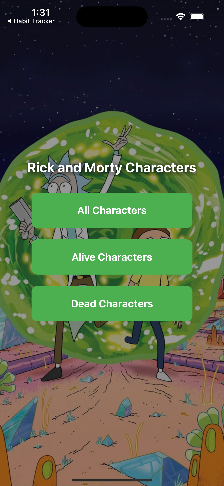
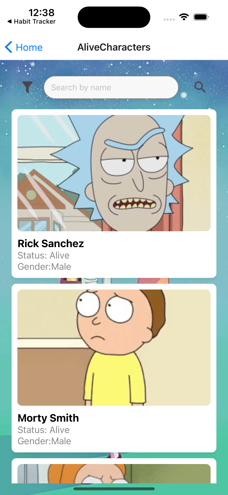
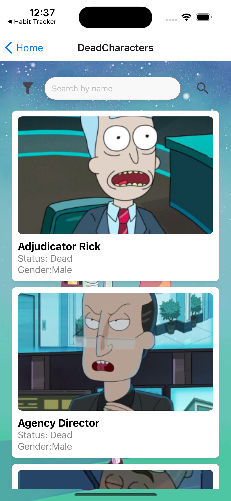

# RickyandMorte

# Ricky and Morty App

## Getting Started

This is a React Native application that fetches and displays characters from the Ricky and Morty API. The following instructions will guide you through setting up and running the application locally.

## Prerequisites

- Install Node.js and npm ([Node.js Installation Guide](https://nodejs.org/en/download/)).
- Install React Native CLI ([React Native CLI Installation Guide](https://reactnative.dev/docs/environment-setup)).
- Have an IDE like VSCode or Android Studio.

## Setup Instructions

### 1. Clone the Repository

First, clone the repository to your local machine:

```bash
git clone <repository-url>
cd <repository-directory>
```
## Screens

### 2. Install Dependencies
```bash
npm install
```

### 3. Configure the API

The application fetches data from the Ricky and Morty API. The API integration is already set up in the CharacterScreen.js file using Axios. No further configuration is required.

5. Run the Application
To run the application locally, execute:

For Android:
```bash
npx expo run:android
```

For iOS:
```bash
npx expo run:ios
```

### screenshots

<div>
<div style="display: flex; flex-direction: 'row';">




</div>